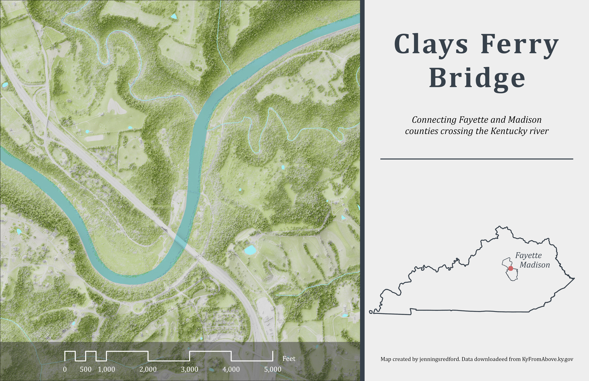

# Clays Ferry Bridge

 ## The super-connector bridge spanning the Kentucky river between Fayette and Madison counties 
 

Clays Ferry Bridge is three former bridges combined into one carrying I-75 as well as US 25 and 421. This area recently suffered a major flooding event like many other areas of Kentucky. If you've ever been to Proud Mary's BBQ right on the Kentucky River, you know the place. You may have even seen the flooding aftermath on recent news segments or social media posts. Well, at least this is the case for me and I wanted to visualize the area, so this is the final result. 

     
*Clays Ferry Bridge*

[Link to high-resolution version](lab-07.pdf)     

Map created by jenningsredford for Spring 2025, University of Kentucky, GEO 409. Data downloaded from KyFromAbove.ky.gov. Data processed using Esri's ArcGIS Pro and Blender.

